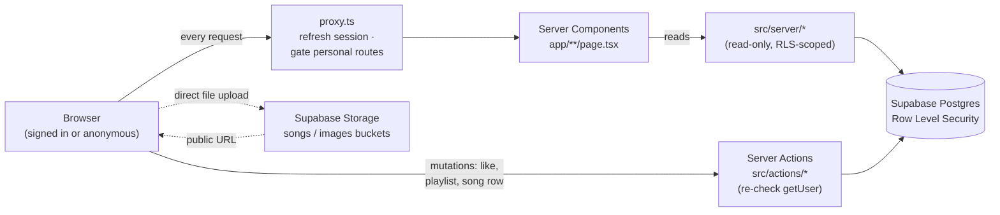

# SpotifyAgain

A full-stack music streaming app. Browse and play public tracks with no account, or sign in with Google to upload your own, like songs, and build playlists.

I built it as a portfolio piece to work through the parts of full-stack that are genuinely hard: authenticated file uploads, blob storage, per-row data ownership, search, and an audio player that keeps playing as you move around the app.


### [Live demo → spotifyagain.onrender.com](https://spotifyagain.onrender.com)

> Heads-up: the demo runs on Render's free tier, so it sleeps when idle. The first load can take around 50 seconds to wake up, then it's quick. No sign-up needed to browse and play.

---

## Overview

Most clones hide everything behind a login. This one doesn't. You land on the home page and can play music right away, no account required, which is the whole point: a recruiter can open the live link and hear a track within seconds.

Sign in with Google and the creator side opens up: upload your own audio (public or private), like songs, and organize them into playlists. All of it sits behind a bottom player that stays put as you navigate, with live search and a personal library.

It's an independent portfolio clone of Spotify's UX, not affiliated with Spotify, and it ships none of Spotify's trademarks or assets (see [License & legal](#license--legal)).

## Features

**Open to everyone (no account):**
- Browse a sectioned home of public songs and play any of them through a player that never stops between pages.
- Full transport controls: play/pause, seek, volume, next/previous, shuffle, and "more like this" (queues more songs by the current artist).
- Live search from the header dropdown or the `/search` page, by title and author.

**Signed in with Google:**
- Upload songs: MP3 + cover art + title/author, set public (everyone sees it) or private (just you).
- Like and unlike songs, with a dedicated Liked Songs page.
- Create, rename, and delete playlists; add, remove, and drag to reorder tracks.
- A personal library of your uploads, with a public/private indicator.

**Everywhere:**
- Responsive from phone to iPad (portrait and landscape) to desktop. The sidebar collapses to a bottom nav, the grid reflows from 1 to 5 columns, and the player bar stays fixed at every width.
- Playback survives navigation; the player never unmounts.

## Tech stack

| Layer | Choice |
| ----- | ------ |
| Language | TypeScript (strict) |
| Framework | Next.js 16 (App Router) + React 19; Server Components, Server Actions, Route Handlers |
| Styling | Tailwind CSS v4 (CSS-first `@theme` tokens) |
| UI primitives | Radix UI (dialog, slider, tooltip), `react-icons`, `sonner` toasts |
| Database | Supabase Postgres with Row Level Security |
| Auth | Supabase Auth (Google OAuth) |
| Storage | Supabase Storage (audio + cover-art buckets) |
| Data clients | `@supabase/supabase-js` + `@supabase/ssr` (cookie-based sessions) |
| Server state | TanStack Query v5 (liked state, playlist edits) |
| Client state | Zustand v5 (ephemeral player + modal state) |
| Audio | `use-sound` (Howler) |
| Forms / DnD | `react-hook-form`, `@dnd-kit` (pointer + touch + keyboard) |
| Hosting | Render (Node Web Service) |

## How it works

Browsing and playback need no session; auth only gates creator actions and personal pages. Every database read is scoped by Postgres Row Level Security, so one query returns public songs to everyone and private rows only to their owner.



A few rules the code sticks to:
- Reads live in `src/server/*` (server Supabase client, RLS-scoped) and run only in Server Components.
- Writes go through `src/actions/*` Server Actions, each re-checking the user with `auth.getUser()` before it touches the database.
- The one client-side write is uploading a file straight to Storage. The matching database row still goes through a Server Action, and if a later step fails the client deletes the objects it already wrote.
- Supabase clients are built in exactly one place (`src/lib/supabase/`); the browser and server clients never cross.

## Notable decisions & challenges

- **Per-row visibility lives in the database, not the app.** Each song has an `is_public` flag, and a single SELECT policy (`is_public OR auth.uid() = user_id`) returns public songs to everyone, including anonymous visitors, plus the owner's own private rows. Nothing in the app re-implements that filter, so visibility can't drift from one page to another.
- **"Private" means unlisted, not secure.** The Storage buckets are public-read, so marking a song private hides it from the catalog through RLS but doesn't lock the file itself. I'd rather call that out than pretend otherwise; proper signed-URL private streaming is out of scope.
- **The player survives navigation.** It mounts once in the app shell and never unmounts. Its state lives in a small Zustand store that holds only ids (no Song objects, no Supabase calls), so moving between pages never interrupts the music.
- **Auth is checked in three places.** Personal routes are gated by the request proxy, by every Server Action, and by the personal-page Server Components themselves. A user id passed from the client is never trusted.
- **You can only reference songs you can see.** RLS constrains likes and playlist inserts to visible songs, so a private song can't be added by guessing its id.

## Run it locally

**Prerequisites:** Node 22 (see `.nvmrc`) and a free [Supabase](https://supabase.com) project.

```bash
# 1. Clone and install
git clone https://github.com/SidVaidya2005/SpotifyAgain.git
cd SpotifyAgain
npm install

# 2. Configure environment
cp .env.example .env.local
# then fill in the values below
```

`.env.local`:

```bash
NEXT_PUBLIC_SUPABASE_URL=your-project-url
NEXT_PUBLIC_SUPABASE_ANON_KEY=your-anon-key
NEXT_PUBLIC_SITE_URL=http://localhost:3000
# optional, only needed to run the local demo-catalog seed script
SUPABASE_SERVICE_ROLE_KEY=your-service-role-key
```

```bash
# 3. Set up the database (schema + RLS + Storage buckets live in supabase/migrations/)
npx supabase db push

# 4. In the Supabase dashboard, enable the Google OAuth provider and add
#    http://localhost:3000 to the Auth redirect URLs.

# 5. Run it
npm run dev   # → http://localhost:3000
```

Other scripts: `npm run build` / `npm run start` (production), `npm run lint`, and `npm run seed:songs` (seeds demo tracks; needs the service-role key).

## Roadmap / out of scope

Things I left out on purpose, to keep the scope honest:

- Payments, premium tiers, or subscriptions.
- Social features: following, sharing, collaborative playlists, comments.
- Recommendations or "made for you" feeds. There's no play history or taste signal to make them real, so a fake one would just be noise.
- Login providers other than Google.
- Native mobile apps; this is a responsive web app.
- Lyrics, podcasts, video, or server-side audio transcoding.
- Truly private streaming (a private bucket with short-lived signed URLs). That's the obvious next step past today's "unlisted" privacy.

## Deeper documentation

The full engineering docs live in [`context/`](./context), which was the source of truth throughout the build. If you want detail on anything specific, start there:

- [`project-overview.md`](./context/project-overview.md) — product scope: who it's for, what's in and out.
- [`architecture.md`](./context/architecture.md) — stack, folder structure, data model, RLS, and the invariants.
- [`code-standards.md`](./context/code-standards.md) — the conventions every change follows.
- [`DESIGN-spotify.md`](./context/DESIGN-spotify.md) — the visual system (color, type, components, responsive).
- [`build-plan.md`](./context/build-plan.md) and [`progress-tracker.md`](./context/progress-tracker.md) — what got built, in order.

## License & legal

This is an independent portfolio clone inspired by Spotify's UX. It is not affiliated with, endorsed by, or connected to Spotify. It uses an original name and branding and ships none of Spotify's trademarks, logos, or assets (the typeface is the freely-licensed [Figtree](https://fonts.google.com/specimen/Figtree)). Copying the layout and interaction patterns for a learning project is the point; copying brand identity isn't.

Released under the [MIT License](./LICENSE).

## Author

**Siddarth Vaidya**

[](https://github.com/SidVaidya2005)
[](https://www.linkedin.com/in/siddarth-vaidya-885871239)
[](https://siddarthvaidya2005-7iyf.onrender.com)
[](mailto:siddarthvaidya2005@gmail.com)
